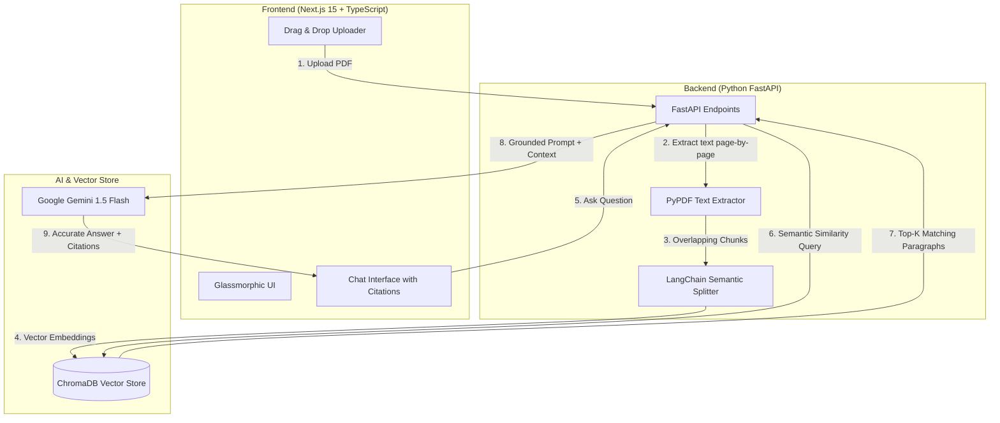

# DocuMind AI 📄🧠 | Enterprise AI Document Intelligence & RAG SaaS Platform

[](https://fastapi.tiangolo.com/)
[](https://www.python.org/)
[](https://nextjs.org/)
[](https://www.trychroma.com/)
[](https://ai.google.dev/)
[](https://tailwindcss.com/)

**DocuMind AI** is an enterprise-grade, full-stack AI Document Intelligence SaaS application. It enables users to upload extensive PDF documents (financial statements, research papers, legal contracts), automatically parses & indexes them into semantic vector embeddings, and allows conversational question-answering with verifiable, page-level citations powered by **Retrieval-Augmented Generation (RAG)** and **Google Gemini LLM**.

---

## 🌟 Key Features

- 📑 **Intelligent PDF Chunking Engine:** Splits long documents into overlapping semantic chunks (`RecursiveCharacterTextSplitter`) while maintaining page-level metadata.
- ⚡ **High-Performance Vector Storage:** Persistent vector storage powered by **ChromaDB** with cosine similarity search.
- 🎯 **Verifiable Page Citations:** Every AI answer includes exact source document citations, page numbers, and matching text snippets.
- ⚡ **One-Click Auto-Summarization:** Instantly generate structured Executive Summaries, Key Metrics, and Action Items for any document.
- 📊 **Rich Markdown & Code Rendering:** Full support for bullet points, markdown tables, bold highlights, and syntax formatting.
- 📋 **Export & Copy Utility:** One-click markdown chat transcript export and response clipboard copy.
- 🔍 **Real-Time Document Search:** Instant document filter and multi-document query routing.
- 💬 **Targeted or Global Knowledge Querying:** Query a single isolated document or search across the entire multi-document knowledge base.
- 🎨 **Futuristic Glassmorphic Interface:** Sleek dark-mode dashboard built with **Next.js 15**, **Tailwind CSS**, and **Lucide Icons**.
- 🚀 **Asynchronous High-Throughput Backend:** Built with **Python 3.12** and **FastAPI** with automatic Swagger API documentation.

---

## 🏗️ System Architecture & RAG Pipeline



---

## 🚀 Getting Started

### 1. Prerequisites
- **Python:** v3.11 or v3.12
- **Node.js:** v18.0.0 or higher
- **Google AI API Key:** Free key from [Google AI Studio](https://aistudio.google.com/)

---

### 2. Backend Setup

```bash
cd backend

# 1. Activate virtual environment
# On Windows:
.\venv\Scripts\activate
# On macOS/Linux:
source venv/bin/activate

# 2. Configure Environment Variables
# Edit backend/.env and add your GOOGLE_API_KEY
# GOOGLE_API_KEY=your_gemini_key_here

# 3. Start the FastAPI Server
python run.py
```
*API will run on `http://localhost:8000` (Interactive Docs: `http://localhost:8000/docs`).*

---

### 3. Frontend Setup

```bash
cd frontend

# 1. Run Development Server
npm run dev
```
*Frontend will run on `http://localhost:3000`.*

---

## 📜 License
This project is licensed under the [MIT License](LICENSE).
