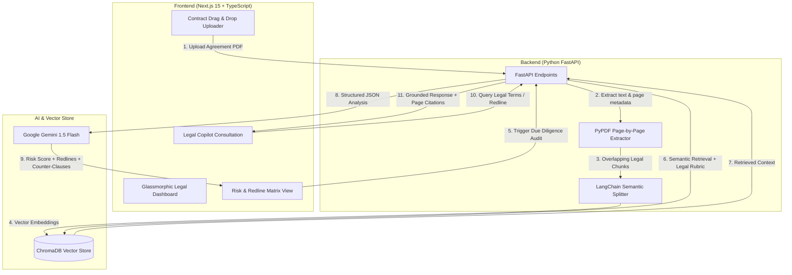

# LexiGuard AI ⚖️🛡️ | Enterprise Legal Contract Intelligence & Risk Auditor

[](https://fastapi.tiangolo.com/)
[](https://www.python.org/)
[](https://nextjs.org/)
[](https://www.trychroma.com/)
[](https://ai.google.dev/)
[](https://tailwindcss.com/)

**LexiGuard AI** is an enterprise-grade Legal Tech SaaS platform for automated contract intelligence, legal due diligence, and risk redlining. Unlike generic LLM chat tools, LexiGuard AI executes structured compliance audits across legal agreements (NDAs, MSAs, Employment Contracts, Vendor SLAs), calculates an automated **Contract Risk Score (0-100)**, flags hazardous clauses (Unlimited Liability, Restrictive Non-Competes, Ambiguous Termination), detects missing protective terms (Negative RAG), and auto-drafts reciprocal counter-clauses with pinpoint page-level citations.

---

## 🌟 Key Enterprise Capabilities

- ⚖️ **Automated Contract Risk Scoring (0-100):** Instantly calculates risk severity (`CRITICAL`, `HIGH`, `MEDIUM`, `SAFE`) based on a standardized legal audit rubric.
- 🚨 **Clause Redline & Hazard Matrix:** Identifies risky clauses, provides plain-English legal risk explanations, and auto-drafts fair **AI Counter-Clauses** ready to copy.
- ⚠️ **Missing Clause Detection (Negative Pattern RAG):** Audits for omitted essential terms (e.g. Limitation of Liability Caps, Mutual Termination, GDPR Data Breach Notifications).
- 💬 **LexiGuard Legal Copilot:** Multi-turn legal assistant capable of drafting redlines, checking liability caps, and answering queries with exact page citations.
- 📋 **One-Click Due Diligence Report Export:** Generates executive Markdown and PDF audit reports ready for attorneys, executives, or clients.
- ⚡ **ChromaDB Clause Vector Store:** Persistent dense vector retrieval indexed page-by-page.
- 🎨 **Futuristic Enterprise Glassmorphism UI:** Built with **Next.js 15**, **Tailwind CSS**, and **Lucide Icons**.

---

## 🏗️ System Architecture & Legal RAG Pipeline



---

## 🚀 Getting Started

### 1. Prerequisites
- **Python:** v3.11 or v3.12
- **Node.js:** v18.0.0 or higher
- **Google AI API Key:** Free key from [Google AI Studio](https://aistudio.google.com/)

---

### 2. Backend Setup

```bash
cd backend

# 1. Activate virtual environment
# On Windows:
.\venv\Scripts\activate
# On macOS/Linux:
source venv/bin/activate

# 2. Configure Environment Variables
# Edit backend/.env and add your GOOGLE_API_KEY
# GOOGLE_API_KEY=your_gemini_key_here

# 3. Start the FastAPI Server
python run.py
```
*API will run on `http://localhost:8000` (Interactive Docs: `http://localhost:8000/docs`).*

---

### 3. Frontend Setup

```bash
cd frontend

# 1. Run Development Server
npm run dev
```
*Frontend will run on `http://localhost:3000`.*

---

## 📜 License
This project is licensed under the [MIT License](LICENSE).

